# Legal Eagles in the Cloud: Hacking the Court System (Legally) with Google

The best part of *Breaking Bad* is the lawyer—and yes, I did binge-watch all seven seasons of *Better Call Saul*. Since then, I've imagined deftly navigating the complexities of the courtroom and delivering dramatic closing arguments. While my legal career may have taken a different turn, I'm excited to say that, with the help of AI, we might all be closer to that courtroom dream.


Today, we’re diving into how to use Google’s powerful AI tools—like Vertex AI, Firestore, and Cloud Run functions—to process and understand legal data, perform lightning-fast searches, and maybe, just maybe, help your imaginary client (or yourself) out of a sticky situation.


You might not be cross-examining a witness, but with our system, you’ll be able to sift through mountains of information, generate clear summaries, and present the most relevant data in seconds.


## Architecture
This project focuses on building a legal assistant using Google Cloud AI tools, emphasizing how to process, understand, and search legal data. The system is designed to sift through large amounts of information, generate summaries, and present relevant data quickly.


The architecture of the legal assistant involves several key components:

• **Building Knowlegebase from unstructure data**: Google Cloud Storage (GCS) is used to store legal documents. Firestore, a NoSQL database, functions as a vector store, holding document chunks and their corresponding embeddings. Vector Search is enabled in Firestore to allow for similarity searches.  When a new legal document is uploaded to GCS, Eventarc triggers a Cloud Run function. This function processes the document by splitting it into chunks and generating embeddings for each chunk using Vertex AI's text embedding model. These embeddings are then stored in Firestore alongside the text chunks.


• **Application powered by LLM & RAG** : The core of the question-answering system is the ask_llm function which uses the langchain library to interact with a Vertex AI Gemini Large Language Model. It creates a HumanMessage from the user's query, and includes a SystemMessage that instructs the LLM to act as a helpful legal assistant. The system uses a Retrieval-Augmented Generation (RAG) approach, where, before answering a query, the system uses the search_resource function to retrieve relevant context from the Firestore vector store. This context is then included in the SystemMessage to ground the LLM's answer in the provided legal information.


The project aims to move away from LLMs' "creative interpretations" by using RAG, which first retrieves relevant information from a trusted legal source before generating an answer. This results in more accurate, informed responses based on actual legal information. 

The system is built using various Google Cloud services, such as Google Cloud Shell, Vertex AI, Firestore, Cloud Run, and Eventarc

## Before you begin

1.  In the [Google Cloud Console](https://console.cloud.google.com/), on the project selector page, select or create a Google Cloud [project](https://cloud.google.com/resource-manager/docs/creating-managing-projects).
2.  Make sure that billing is enabled for your Cloud project. [Learn how to check if billing is enabled on a project](https://cloud.google.com/billing/docs/how-to/verify-billing-enabled).
3.  You'll use [Cloud Shell](https://cloud.google.com/cloud-shell/), a command-line environment running in Google Cloud. Click **Activate Cloud Shell** at the top of the Google Cloud console.

4.  Once connected to Cloud Shell, verify that you're already authenticated and that the project is set to your project ID using the following command:
    ```bash
    gcloud auth list
    ```

5.  Use the following command to set your project:
    ```bash
    gcloud config set project <YOUR_PROJECT_ID>
    ```

6. Run the following command to enable the necessary Google Cloud APIs:

```bash
gcloud services enable storage.googleapis.com  \
                        run.googleapis.com  \
                        artifactregistry.googleapis.com  \
                        aiplatform.googleapis.com \
                        eventarc.googleapis.com \
                        cloudresourcemanager.googleapis.com \
                        firestore.googleapis.com
```


7. In the Cloud Shell toolbar (t the top of the Cloud Shell pane), click on the "Open Editor" button (it looks like an open folder with a pencil).
This will open the Cloud Shell Code Editor in a new browser tab or window. You'll see a file explorer on the left side. 

8. Enable Gemini Code Assist in Cloud Shell IDE
    - Click on the **Cloud Code Sign-in** button in the bottom status bar as shown. Authorize the plugin as instructed. If you see **Cloud Code - no project** in the status bar, select that and then select the specific Google Cloud Project from the list of projects that you plan to work with.

    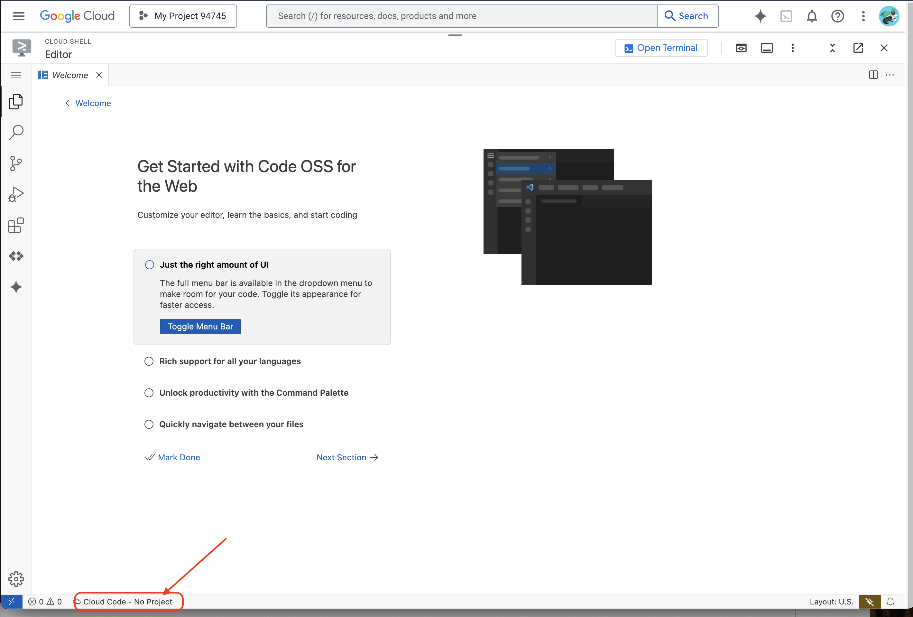

    - Click on the **Code Assist** button in the bottom right corner as shown and select one last time the correct Google Cloud project. If you are asked to enable the Cloud AI Companion API, please do so and move forward. Once you've selected your Google Cloud project, ensure that you are able to see that in the Cloud Code status message in the status bar and that you also have Code Assist enabled on the right, in the status bar as shown below:

    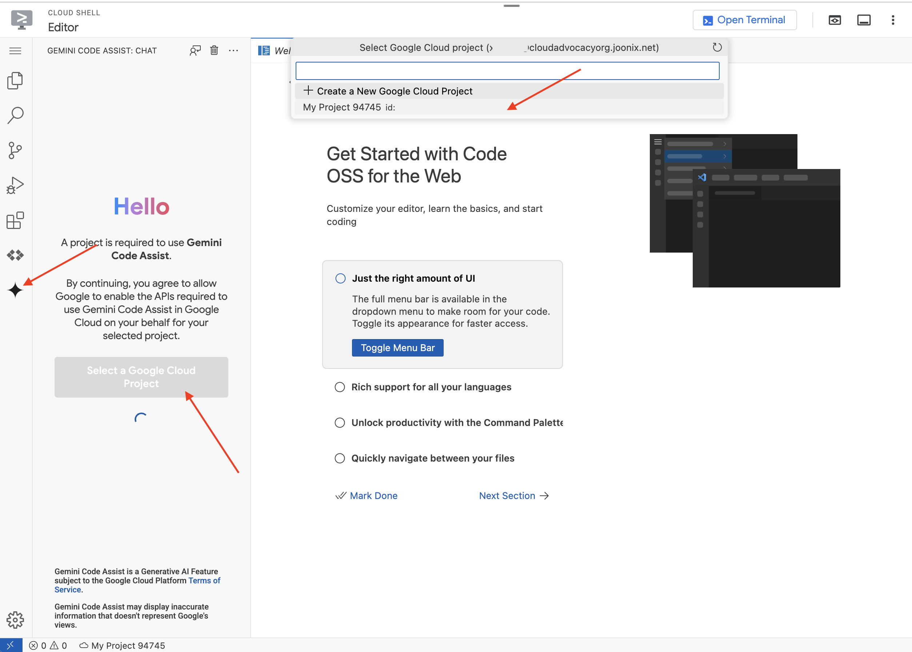

    Note: if it ask you to enable compaignion API. please ignore You are missing a valid license for Gemini Code Assist and may lose access to the service. Contact your billing administrator to purchase or assign a license.
    

9. Open the terminal in the cloud IDE,

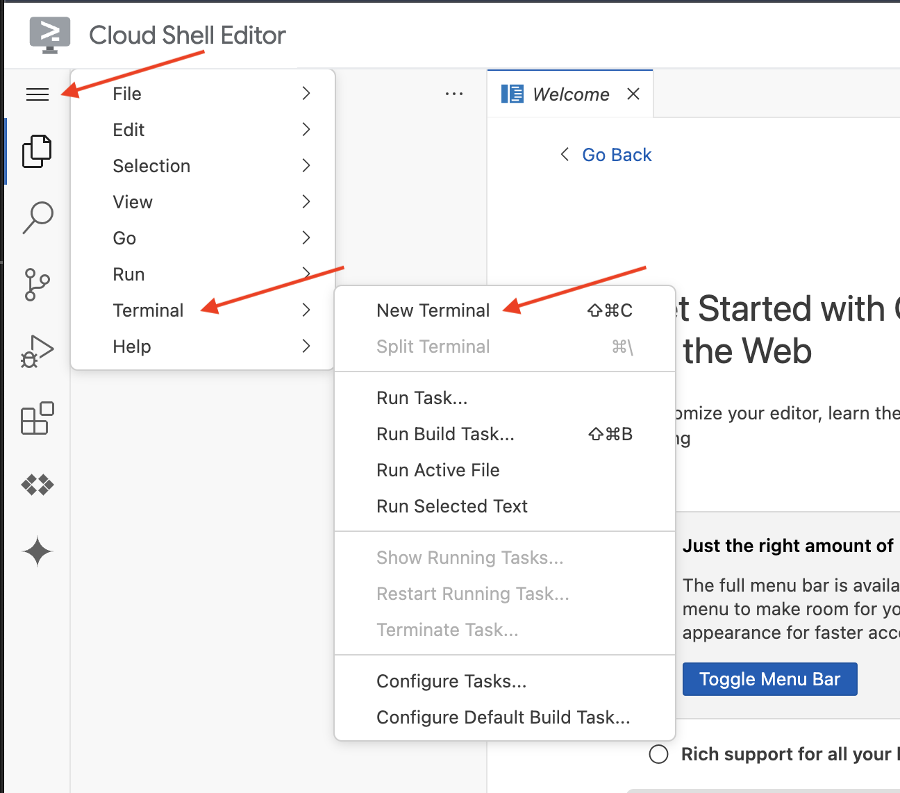

10. In the terminal download the Bootstrap Skeleton Project, 
```
git clone https://github.com/weimeilin79/legal-eagle.git
```
After running this command in the Cloud Shell terminal, a new folder with the repository name will be created in your Cloud Shell environment.

## Let Google Code Assist help you write 
In the Cloud Code Editor's Explorer pane (usually on the left side), you should now see the folder that was created when you cloned the Git repository `legal-eagle`, Open the root folder of your project in the Explorer. If the instructions mention navigating to a legal-eagle folder and then expecting a webapp subfolder within it, you should find and open the legal-eagle folder .

1. Create legal.py, 
    - In the Explorer pane within your opened **webapp** folder, right-click in the file explorer area.
    - Select "New File" from the context menu.
    - Enter the filename `legal.py` and press Enter. This will create an empty `legal.py` file and open it in the editor.

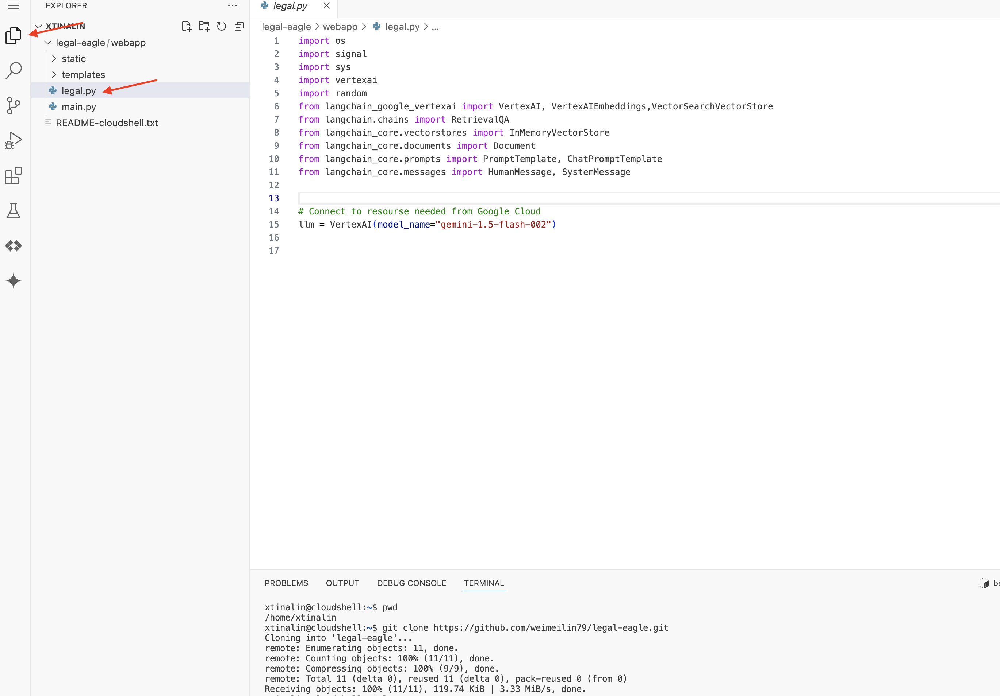

2. In the empty legal.py file in the Cloud Code Editor, you can use different methods to prompt Gemini Code Assist. 

Typing the following prompt legal.py that clearly describes what you want Gemini Code Assist to generate, click on the light bulb icon appeared and selecte **Gemini: Generate Code** (the exact menu item might vary slightly depending on the Cloud Code version).

```
"""
Write a Python function called `ask_llm` that takes a user `query` as input. This function should use the `langchain` library to interact with a Vertex AI Gemini Large Language Model.  Specifically, it should:

1.  Create a `HumanMessage` object from the user's `query`.
2.  Create a `ChatPromptTemplate` that includes a `SystemMessage` and the `HumanMessage`. The system message should instruct the LLM to act as a helpful assistant in a courtroom setting, aiding an attorney by providing necessary information. It should also specify that the LLM should respond in a high-energy tone, using no more than 100 words, and offer a humorous apology if it doesn't know the answer.  
3.  Format the `ChatPromptTemplate` with the provided messages.
4.  Invoke the Vertex AI LLM with the formatted prompt using the `VertexAI` class (assuming it's already initialized elsewhere as `llm`).
5.  Print the LLM's `response`.
6.  Return the `response`.
7.  Include error handling that prints an error message to the console and returns a user-friendly error message if any issues occur during the process.  The Vertex AI model should be "gemini-1.5-flash-002".
"""
```
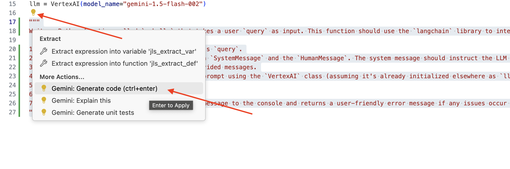


3. Carefully review the generated code
    - Does it roughly follow the steps you outlined in the comment?
    - Does it create a `ChatPromptTemplate` with `SystemMessage` and `HumanMessage`?
   - Does it include basic error handling (`try...except`)?


If the generated code is good and mostly correct, you can accept it (often by pressing Tab or Enter for inline suggestions, or by clicking "Accept" for larger code blocks). If the generated code isn’t exactly what you want, or has errors, don't worry! Gemini Code Assist is a tool to assist you, not to write perfect code on the first try. Edit and modify the generated code to refine it, correct errors, and better match your requirements. You can further prompt Gemini Code Assist by adding more comments or asking specific questions in the Code Assist chat panel.
And if you are still new to the SDK, here is a working example. Feel free to copy and paste this code into your legal.py:
```
import os
import signal
import sys
import vertexai
import random
from langchain_google_vertexai import VertexAI
from langchain_core.prompts import PromptTemplate, ChatPromptTemplate
from langchain_core.messages import HumanMessage, SystemMessage


# Connect to resourse needed from Google Cloud
llm = VertexAI(model_name="gemini-1.5-flash-002")

def ask_llm(query):
    try:
        query_message = {
            "type": "text",
            "text": query,
        }
       
        input_msg = HumanMessage(content=[query_message])
        prompt_template = ChatPromptTemplate.from_messages(
            [
                SystemMessage(
                    content=(
                        "You are a helpful assistant, and you are with the attorney in a courtroom, you are helping him to win the case by providing the information he needs "
                        "Don't answer if you don't know the answer, just say sorry in a funny way possible"
                        "Use high engergy tone, don't use more than 100 words to answer"
                       # f"Here are some past conversation history between you and the user {relevant_history}"
                       # f"Here are some contenxt that is relavant to the question {relevant_resource} that you might use"
                    )
                ),
                input_msg,
            ]
        )

        prompt = prompt_template.format()
        
        response = llm.invoke(prompt)
        print(f"response: {response}")

        return response
    except Exception as e:
        print(f"Error sending message to chatbot: {e}") # Log this error too!
        return f"Unable to process your request at this time. Due to the following reason: {str(e)}"

```

5. Create a function to handle a route that will respond to user's questions. Open `main.py` in the Cloud Shell Editor. Similar to how you generated ask_llm in `legal.py`, use Gemini Code Assist to Generate Flask Route and ask_question Function. Type in the following PROMPT as a comment in `main.py`:
```
"""
PROMPT:
Create a Flask endpoint that accepts POST requests at the '/ask' route. 
The request should contain a JSON payload with a 'question' field. Extract the question from the JSON payload. 
Call a function named ask_llm (located in a file named legal.py) with the extracted question as an argument. 
Return the result of the ask_llm function as the response with a 200 status code. 
If any error occurs during the process, return a 500 status code with the error message.
"""
```
If the generated code is good and mostly correct, you can accept it (often by pressing Tab or Enter for inline suggestions, or by clicking "Accept" for larger code blocks). If the generated code isn’t exactly what you want, or has errors, don't worry! Gemini Code Assist is there to assist you, not to write perfect code on the first attempt. Edit and modify the generated code to refine it, correct errors, and better match your requirements. You can further prompt Gemini Code Assist by adding more comments or by asking specific questions in the Code Assist chat panel.
By following these refined steps, you should be able to successfully enable Gemini Code Assist, set up your project, and leverage Gemini Code Assist to generate the `ask` function in your `main.py` file. If you are not fimiliar with Python, here is a working example, feel free to copy and paste this into your `main.py`

```
@app.route('/ask', methods=['POST'])
def ask_question():
    data = request.get_json()
    question = data.get('question')
    try:
        # call the ask_llm in legal.py
        answer_markdown = legal.ask_llm(question)

        
        print(f"answer_markdown: {answer_markdown}")

        # Return the Markdown as the response
        return answer_markdown, 200

    except Exception as e:
        return f"Error: {str(e)}", 500  # Handle errors appropriately
```

## Test and run the Application Locally in Cloud Shell

1. In the editor's terminal, make sure you are logged in, run the following, continue by typing `Y` and follow the prompted instruction in the terminal.
```
gcloud auth login
```

2. After login, make sure you change project setting in the terminal by running
```
gcloud config set project <PROJECT_ID>
```

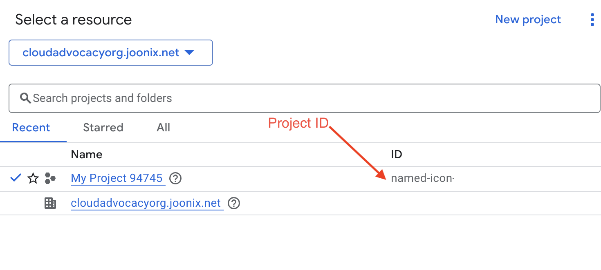

3. Install dependent libraries and start the Web UI locally.
```
cd ~/legal-eagle/webapp
pip install -r requirements.txt 
python3 main.py
```


Look for startup messages in the Cloud Shell terminal output. Flask usually prints messages indicating that it's running and on what port. 
 * Running on http://127.0.0.1:8080
Keep the Terminal Running: Do not close the Cloud Shell terminal or stop the running python3 main.py process while you want to access the web preview. 
The  application needs to keep running to serve requests.

2. From the "Web preview" menu,choose **Preview on port 8080**. Cloud Shell will open a new browser tab or window with the web preview of your application.

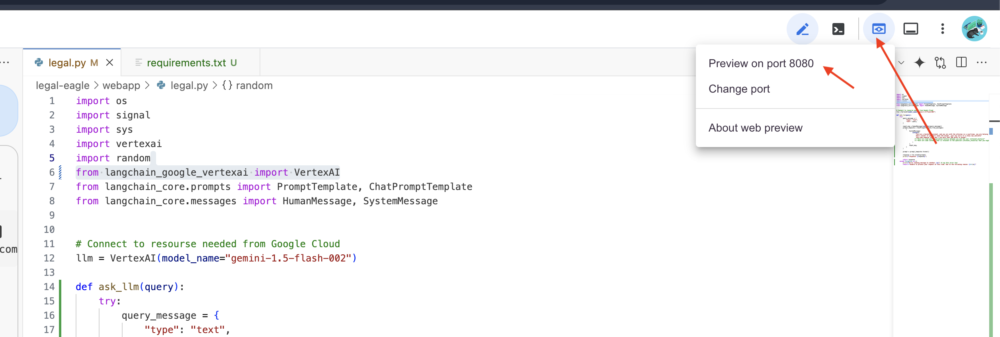


3. In the application interface, type in a couple of questions and see how the LLM responds. If you look closely at the answers, you’ll likely notice it can hallucinate, be vague or generic, and sometimes misinterpret your questions.

4. Type `ctrl+c` to terminate the locally run Web UI.

## Setting up the Vector Store

Time to put an end to these LLM 'creative interpretations' of the law.That’s where Retrieval-Augmented Generation (RAG) comes to the rescue! Think of it like giving our LLM access to a super-powered legal library right before it answers your questions. Instead of relying solely on its general knowledge (which can be fuzzy or outdated depending on the model), RAG first fetches relevant information from a trusted source – in our case, legal documents – and then uses that context to generate a much more informed and accurate answer. It's like the LLM doing its homework before stepping into the courtroom!


We'll use Firestore as our vector store.


To build our RAG system, we need a place to store all those legal documents and, importantly, make them searchable by meaning. That's where Firestore comes in! Firestore is Google Cloud's super flexible, super scalable NoSQL document database. We're going to use Firestore as our vector store. We'll store chunks of our legal documents in Firestore, and for each chunk, we'll also store its embedding – that fancy numerical representation of its meaning. Then, when you ask our Legal Eagle a question, we'll use Firestore's vector search to find the chunks of legal text that are most relevant to your query. This retrieved context is what RAG uses to give you answers that are grounded in actual legal information, not just LLM imagination!

1. In a new tab/window, go to the Google Cloud console title bar, in the Search field, type Firestore, click Search, and then click Firestore.
2. Choose `Native mode` with leave database name as `(default)`.
3. Select single `region`:  `us-central1` , Click **Create Database**. Firestore will provision your database, which might take a few moments.
4. Back in the Cloud IDE's terminal (Or cloud shell if you prefer). Create a Vector Index on the embedding_vector field, to enable vector search, you need to create a vector index on the embedding_vector field in your legal_documents collection.
```    
export PROJECT_ID=$(gcloud config get project)
gcloud firestore indexes composite create \
--collection-group=legal_documents \
--query-scope=COLLECTION \
--field-config field-path=embedding,vector-config='{"dimension":"768", "flat": "{}"}' \
--project=${PROJECT_ID}
```

Firestore will start creating the vector index. Index creation can take some time, especially for larger datasets. You'll see the index in a "Creating" state, and it will transition to "Ready" when it's built.

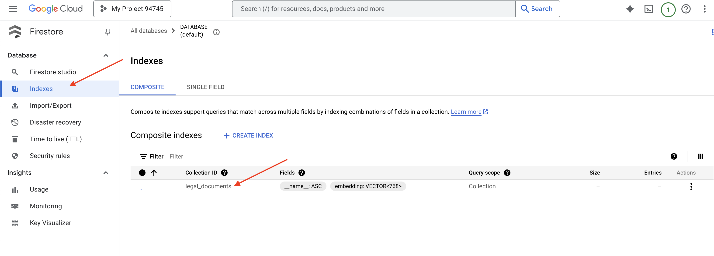


## Loading Data into the Vector Store

Now that we understand RAG and our trusty Firestore vector store, it's time to build the engine that populates our legal library!

So, how do we make legal documents 'searchable by meaning'? The magic is in embeddings! Think of embeddings as converting words, sentences, or even whole documents into numerical vectors – lists of numbers that capture their semantic meaning. Similar concepts get vectors that are 'close' to each other in vector space. We use powerful models (like those from Vertex AI) to perform this conversion. It's like creating a secret numerical code for each piece of legal text, allowing our system to understand and compare them based on what they mean, not just the words they use.

And to automate our document loading, we'll use Cloud Run Functions and Eventarc. Cloud Run Function is a lightweight, serverless container that runs your code only when needed. We'll package our document processing Python script into a container and deploy it as a Cloud Run Function. But how does it know when to run? That's where Eventarc comes in! Eventarc lets us set up triggers that react to events happening in Google Cloud. We'll create an Eventarc trigger that 'listens' to our GCS bucket. Whenever a new legal document is uploaded to the bucket, Eventarc will automatically wake up our Cloud Run Function and tell it to start processing that new file – completely hands-free document indexing!


1. In the Navigation menu, scroll down to "Storage" and click on "Cloud Storage".
2. Click on "Buckets" in the left-hand menu.
3. Click on the "+ CREATE" button at the top.
4. Configure your bucket (Important settings):
    - **bucket name**: **<Project ID>-doc-bucket**  
    - **region**: Select the `us-central1` region.
    - **Storage class**: "Standard". Standard is suitable for frequently accessed data.
    - **Access control**: Leave the default "Uniform access control" selected. This provides consistent, bucket-level access control.
    - **Advanced options**: For this tutorial, the default settings are usually sufficient.
Click the **CREATE** button to create your bucket.

You will now see your newly created bucket in the Buckets list. Remember your bucket name, you'll need it later.

## Set up a Cloud Run Function

1. In the Cloud Shell Code Editor, navigate to the working directory **legal-eagle**: Use cd command in the Cloud Editor terminal to create the folder.
```
cd ~/legal-eagle
mkdir loader
cd loader
```

3. Create `main.py`,`requirements.txt`, and `Dockerfile` files. In the Cloud Shell terminal, use the touch command to create the files:
```
touch main.py requirements.txt Dockerfile
```

4. You'll see the newly created folder called `*loader` and the three files. 

6. Edit `main.py` under the `loader` folder. In the file explorer on the left, navigate to the directory where you created the files and double-click on `main.py` to open it in the editor.
Paste the following Python code into `main.py`:

This application processes new files uploaded to the GCS bucket, splits the text into chunks, generates embeddings for each chunk, and stores the chunks and their embeddings in Firestore.
```
import os
import json
from google.cloud import storage
import functions_framework
from langchain_google_vertexai import VertexAI, VertexAIEmbeddings
from langchain_google_firestore import FirestoreVectorStore
from langchain.text_splitter import RecursiveCharacterTextSplitter
import vertexai

PROJECT_ID = os.environ.get("GOOGLE_CLOUD_PROJECT")  # Get project ID from env
embedding_model = VertexAIEmbeddings(
    model_name="text-embedding-004" ,
    project=PROJECT_ID,)

COLLECTION_NAME = "legal_documents"

# Create a vector store
vector_store = FirestoreVectorStore(
    collection="legal_documents",
    embedding_service=embedding_model,
    content_field="original_text",
    embedding_field="embedding",

)

@functions_framework.cloud_event
def process_file(cloud_event):
    print(f"CloudEvent received: {cloud_event.data}")  # Print the parsed event data
     
    """Triggered by a Cloud Storage event.
       Args:
            cloud_event (functions_framework.CloudEvent): The CloudEvent
                containing the Cloud Storage event data.
    """
    try:
        event_data = cloud_event.data
        bucket_name = event_data['bucket']
        file_name = event_data['name']

    except (json.JSONDecodeError, AttributeError, KeyError) as e:  # Catch JSON errors
        print(f"Error decoding CloudEvent data: {e} - Data: {cloud_event.data}")
        return "Error processing event", 500  # Return an error response

   
    print(f"New file detected in bucket: {bucket_name}, file: {file_name}")


    storage_client = storage.Client()
    bucket = storage_client.bucket(bucket_name)
    blob = bucket.blob(file_name)

    try:
        # Download the file content as string (assuming UTF-8 encoded text file)
        file_content_string = blob.download_as_string().decode("utf-8")

        print(f"File content downloaded. Processing...")

        # Split text into chunks using RecursiveCharacterTextSplitter
        text_splitter = RecursiveCharacterTextSplitter(
            chunk_size=500,
            chunk_overlap=100,
            length_function=len,
        )
        text_chunks = text_splitter.split_text(file_content_string)

        print(f"Text split into {len(text_chunks)} chunks.")
 

        # Add the docs to the vector store
        vector_store.add_texts(text_chunks)    

        print(f"File processing and Firestore upsert complete for file: {file_name}")
        return "File processed successfully", 200  #  Return success response


    except Exception as e:
        print(f"Error processing file {file_name}: {e}")
```

7. Edit `requirements.txt`.Paste the following lines into the file:
```
Flask==2.3.3
requests==2.31.0
google-generativeai>=0.2.0
langchain
langchain_google_vertexai
langchain-community
langchain-google-firestore
google-cloud-storage
functions-framework
```

## Test and build Cloud Run Function

1. Installs the necessary Python libraries for the Cloud Run function
```
cd ~/legal-eagle/loader
pip install -r requirements.txt
```
2. Starts a local emulator for the Cloud Run function 
```
functions-framework --target process_file --signature-type=cloudevent --source main.py
```

3. Keep the last terminal running, open a new terminal, and upload a file to the bucket 
```
gsutil cp ~/legal-eagle/court_cases/case-01.txt gs://named-icon-449202-s9-doc-bucket/
```
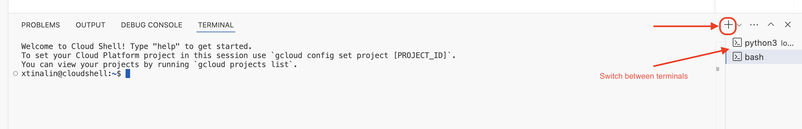

4. While the emulator is running, you can send test CloudEvents to it. You'll need a separate termnial in the IDE for this
```
curl -X POST -H "Content-Type: application/json" \
     -d '{
       "specversion": "1.0", 
       "type": "google.cloud.storage.object.v1.finalized",
       "source": "//storage.googleapis.com/<YOUR_BUCKET_NAME>",
       "subject": "objects/case-01.txt",
       "id": "my-event-id",
       "time": "2024-01-01T12:00:00Z",
       "data": {
         "bucket": "<YOUR_BUCKET_NAME>",
         "name": "case-01.txt" 
       }
     }' http://localhost:8080/
```
It should return OK.

5. You'll verify Data in Firestore, go to the Google Cloud Console and navigate to "Databases" then "Firestore" and select the "Data" tab and then the `legal_documents` collection. You'll see new documents have been created in your collection, each representing a chunk of the text from the uploaded file.

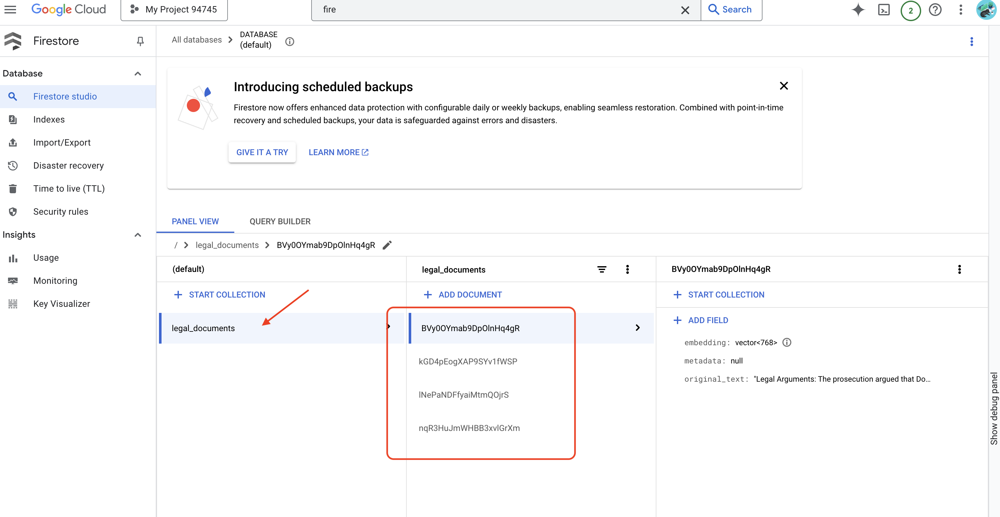

6. In the terminal running the emulator, type `ctrl+c` to exit. And close the secound terminal. 

## Build container image and push to Artifacts repositories
1. Time to deloy this the cloud. In the file explorer, double-click on Dockerfile. Ask Gemini to generate the dockerfile for you, open the **Gemini Code Assist** and use the following prompt to generate the file.
```
In the loader folder, 
Generate a Dockerfile for a Python 3.12 Cloud Run service that uses functions-framework. It needs to:
1. Use a Python 3.12 slim base image.
2. Set the working directory to /app.
3. Copy requirements.txt and install Python dependencies.
4. Copy main.py.
5. Set the command to run functions-framework, targeting the 'process_file' function on port 8080
```

For best practice, it's recommand to click on the **Diff with Open File**(two arrows with opposite directions, and accept the changes.)
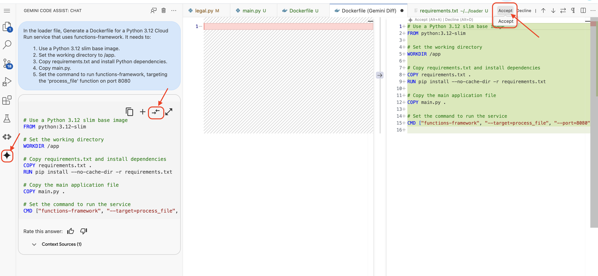


If you are new to Container, here is a working example:
```
# Use a Python 3.12 slim base image
FROM python:3.12-slim

# Set the working directory to /app
WORKDIR /app

# Copy requirements.txt and install Python dependencies
COPY requirements.txt .
RUN pip install --no-cache-dir -r requirements.txt

# Copy main.py
COPY main.py .

# Set the command to run functions-framework
CMD ["functions-framework", "--target", "process_file", "--port", "8080"]
```

2. In the terminal, create an artifacts repository to store the docker image we are going to build.

```
gcloud artifacts repositories create my-repository \
    --repository-format=docker \
    --location=us-central1 \
    --description="My repository"

```

You should see **Created repository [my-repository].**

3. Run the following command to build the Docker image. 
```
cd ~/legal-eagle/loader
export PROJECT_ID=$(gcloud config get project)
docker build -t gcr.io/${PROJECT_ID}/legal-eagle-loader .
```

4. You'll push that to the registry now
```
export PROJECT_ID=$(gcloud config get project)
docker tag gcr.io/${PROJECT_ID}/legal-eagle-loader us-central1-docker.pkg.dev/${PROJECT_ID}/my-repository/legal-eagle-loader
docker push us-central1-docker.pkg.dev/${PROJECT_ID}/my-repository/legal-eagle-loader
```

## Create the Cloud Run function and set up Eventarc trigger

1. In the Google Cloud Console, navigate to "Cloud Run". Click on **CREATE SERVICE**.

2. Configure your Cloud Run service:
    - **Container image**: Select "Select container image". Enter the image URL you pushed to Artifact Registry (e.g., us-central1-docker.pkg.dev/<your-project-id>/my-repository/legal-eagle-loader).
    - **Service name**: `legal-eagle-loader`
    - **Region**: Select the `us-central1` region.
    - **Authentication**: For the purpose of this workshop, you can allow "Allow unauthenticated invocations". For production, you'll likely want to restrict access.
    - **Container, Networking, Security** : default.
Click **CREATE**. Cloud Run will deploy your service.

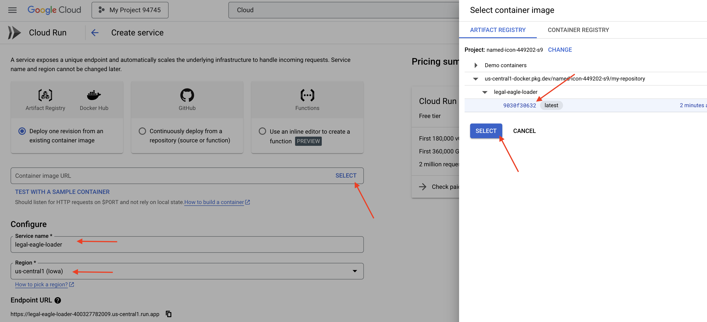

To trigger your Cloud Run service when files are uploaded to your GCS bucket, we'll use Eventarc. Eventarc allows you to route events from various GCP services to Cloud Run, Cloud Functions, or other destinations.

3. In the Google Cloud Console, navigate to "Eventarc" -> "Triggers". Click on "+ CREATE TRIGGER".

4. Configure Eventarc Trigger:
    - Trigger name: `legal-eagle-upload-trigger`.
    - Event Type: Google Sources
    - Event provider: Select **Cloud Storage**.
    - Event: Choose `google.cloud.storage.object.v1.finalized` 
    - Cloud Storage Bucket: Select your GCS bucket from the dropdown.
    - Destination:
        Destination type: "Cloud Run service".
    - Service: Select `legal-eagle-loader`.
    - Region: `us-central1`
    - Path: Leave this blank for now .
    - Grant all the permission it prompted on the page
Click **CREATE**. Eventarc will now set up the trigger.

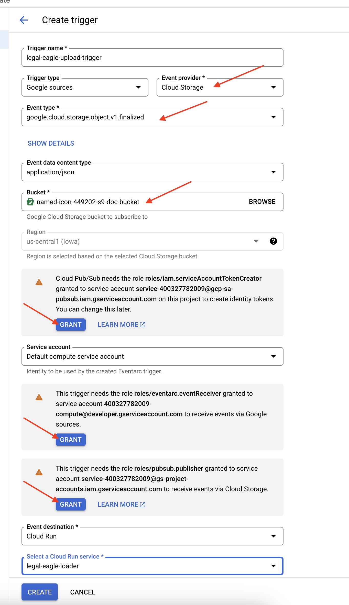

The Cloud Run service needs permission to read files from various components. We need to grant the service's service account permission it needs.

It make take few minutes for the permission to sync, and fail during trigger creation, just re-try a couple more times. 


## Upload legal documents to the GCS bucket

1. Upload the court case file to your GCS bucket.

```
gsutil cp ~/legal-eagle/court_cases/*.txt gs://<YOUR_GCS_BUCKET_NAME>/
```


2. Monitor Cloud Run Service Logs, go to "Cloud Run" -> your service `legal-eagle-loader` -> "Logs". And check the logs for successful processing messages, including:
```
    "CloudEvent received:"
    "New file detected in bucket:"
    "File content downloaded. Processing..."
    "Text split into ... chunks."
    "File processing and Firestore upsert complete..."
```
Look for any error messages in the logs and troubleshoot if necessary.

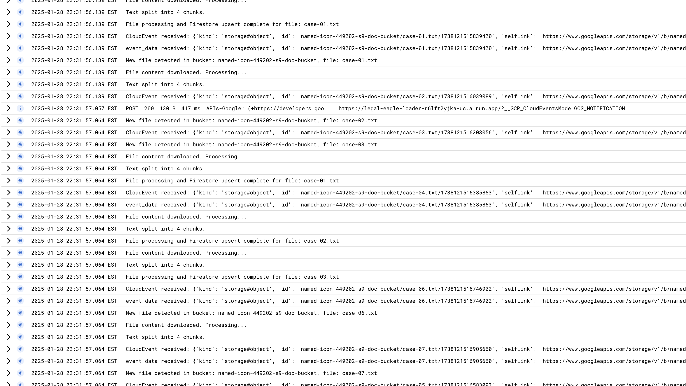

3. Verify Data in Firestore. Go to "Databases" -> "Firestore" -> "Data" in the Cloud Console and open your legal_documents collection.
You should see new documents created in your collection. Each document will represent a chunk of the text from the file you uploaded and will contain:
```
metadata: currently empty
original_text_chunk: The text chunk content.
embedding_: A list of floating-point numbers (the Vertex AI embedding).
```
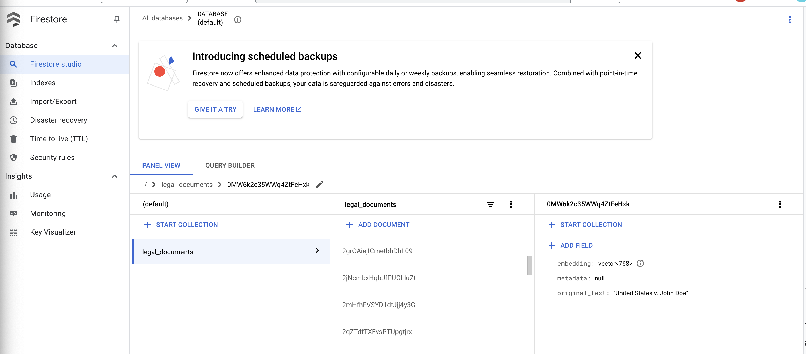


## Implementing RAG

You will now need to update your `legal.py` file under the `webapp` folder to incorporate the** Retrieval-Augmented Generation (RAG)** implementation, which enables the LLM to search relevant documents in Firestore before providing an answer.

1. Import `FirestoreVectorStore` and other required modules from langchain and vertexai. Add following to the current `legal.py`
```
from langchain_google_vertexai import VertexAIEmbeddings
from langchain_google_firestore import FirestoreVectorStore
```

2. Initialize the Vertex AI and the embedding model.You'll be using `text-embedding-004`.

```
PROJECT_ID = os.environ.get("GOOGLE_CLOUD_PROJECT")  # Get project ID from env
embedding_model = VertexAIEmbeddings(
    model_name="text-embedding-004" ,
    project=PROJECT_ID,)
```

3.  Create a FirestoreVectorStore pointing to the legal_documents collection, using the initialized embedding model and specifying the content and embedding fields.
        - The content field is 1original_text1 
        - embedding field is 1embedding1.
```
COLLECTION_NAME = "legal_documents"

# Create a vector store
vector_store = FirestoreVectorStore(
    collection="legal_documents",
    embedding_service=embedding_model,
    content_field="original_text",
    embedding_field="embedding",
)
```
4. Define a function called `search_resource` that takes a query, performs a similarity search using vector_store.similarity_search, and returns the combined results.

```
def search_resource(query):
    results = []
    results = vector_store.similarity_search(query, k=5)
    
    combined_results = "\n".join([result.page_content for result in results])
    print(f"==>{combined_results}")
    return combined_results

```
5. Modifying `ask_llm` function and use the `search_resource` function to retrieve relevant context based on the user's query.     

```
def ask_llm(query):
    try:
        query_message = {
            "type": "text",
            "text": query,
        }

        relevant_resource = search_resource(query)
       
        input_msg = HumanMessage(content=[query_message])
        prompt_template = ChatPromptTemplate.from_messages(
            [
                SystemMessage(
                    content=(
                        "You are a helpful assistant, and you are with the attorney in a courtroom, you are helping him to win the case by providing the information he needs "
                        "Don't answer if you don't know the answer, just say sorry in a funny way possible"
                        "Use high engergy tone, don't use more than 100 words to answer"
                        f"Here are some contenxt that is relavant to the question {relevant_resource} that you might use"
                    )
                ),
                input_msg,
            ]
        )

        prompt = prompt_template.format()
        
        response = llm.invoke(prompt)
        print(f"response: {response}")

        return response
    except Exception as e:
        print(f"Error sending message to chatbot: {e}") # Log this error too!
        return f"Unable to process your request at this time. Due to the following reason: {str(e)}"

```

6. After implementing RAG in legal.py, you should test it locally before deploying. 1. Installs the necessary Python libraries for the Cloud Run function
```
cd ~/legal-eagle/webapp
pip install -r requirements.txt
```

7. Run the application with the command 
```
python3 main.py
```
8. Use webpreview to access the application, talk to the assistance and type `ctrl+c` to exit the locally run process

9. To deploy the web application to Cloud Run, it's be similar to the loader fuction. You will build, tag and push the Docker image to the Artifact Registry:
```
export PROJECT_ID=$(gcloud config get project)
docker build -t gcr.io/${PROJECT_ID}/legal-eagle-webapp .
docker tag gcr.io/${PROJECT_ID}/legal-eagle-webapp us-central1-docker.pkg.dev/${PROJECT_ID}/my-repository/legal-eagle-webapp
docker push us-central1-docker.pkg.dev/${PROJECT_ID}/my-repository/legal-eagle-webapp
```

10. Navigate to "Cloud Run" in the Google Cloud Console, Click on **CREATE SERVICE**(or Deploy Container) and configure the Cloud Run service
    - Container image: Select "us-central1-docker.pkg.dev/<YOUR_PROJECT_ID>/my-repository/legal-eagle-webapp".
    - Service name: `legal-eagle-webapp`
    - Region: `us-central1`
    - Authentication: For workshop purposes, allow "Allow unauthenticated invocations" but for production, you'll want to restrict access.
    - Other Settings: Leave the default settings for "Container, Networking, Security".
Click CREATE to deploy the service

11. Once deployed, click on the service to the detail page, you can find the deployed URL avaliable on the top of the page. 
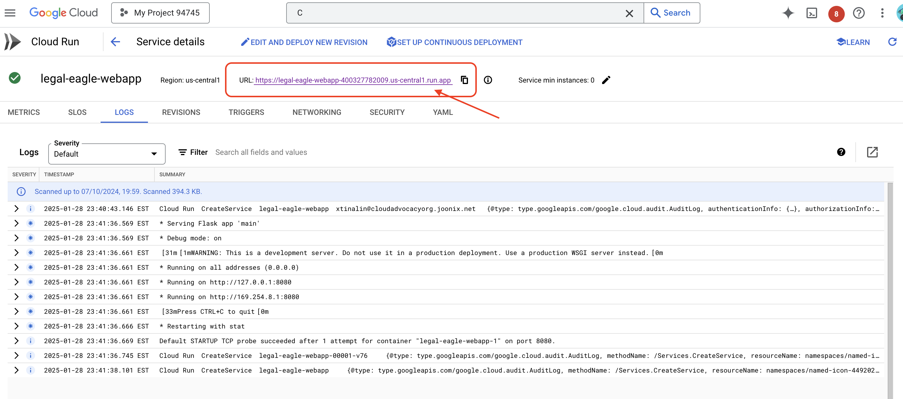

12. Congrats on completeing the workshop! 


## Challenge 

1. **Diverse Media Types:** 
How to ingest and process diverse media types such as court videos and audio recordings, and extract relevant text.


2. **Online Assets**: How to process online assets like web pages live.